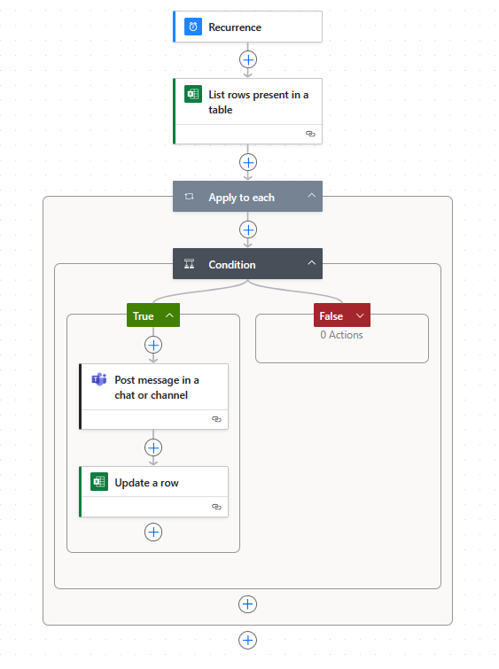

# Watch and Transcribe Calls

This project contains a Python script `watch_and_transcribe.py` that watches for audio input and transcribes calls automatically.

## How It Works

The system uses FreeSWITCH to manage incoming calls. When a call is received:

- FreeSWITCH answers the call automatically.
- It plays a prerecorded message: “Please leave your message.”
- The caller's message is recorded as a `.wav` file and saved to `C:/calls/` with a timestamped filename.
- After 30 seconds, the call ends automatically.
- The Python script then detects and processes these `.wav` recordings for transcription.

## Features

- Real-time audio folder monitoring  
- Automatic speech-to-text transcription  
- Seamless integration with Microsoft Teams via Power Automate  
- Easy to run and customize

## Requirements

- Python 3.x  
- Required libraries (see `requirements.txt`)

## Installation

1. Clone the repo:  
   ```bash
   git clone https://github.com/ManosKalaitzakis/watch-and-transcribe-calls.git

2. Create and activate a virtual environment (Windows):
   ```bash
   python -m venv venv
   .\venv\Scripts\activate

3. Install dependencies:
   ```bash
   pip install -r requirements.txt

## Usage

Run the script with:

python watch_and_transcribe.py

Automation Workflow

After running watch_and_transcribe.py, a Power Automate flow runs every minute to:

    Read new call transcripts from an Excel file (DATA.xlsx) stored on OneDrive.

    Post a message with call details (date, caller, transcript, name) to a Microsoft Teams group chat.

    Update the Excel rows to mark them as sent, preventing duplicate messages.

This flow automates sharing call transcriptions seamlessly to your team.

## Power Automate Flow




Contributing

Feel free to open issues or pull requests.


## License

This project is licensed under the MIT License. See the [LICENSE](LICENSE) file for details.
